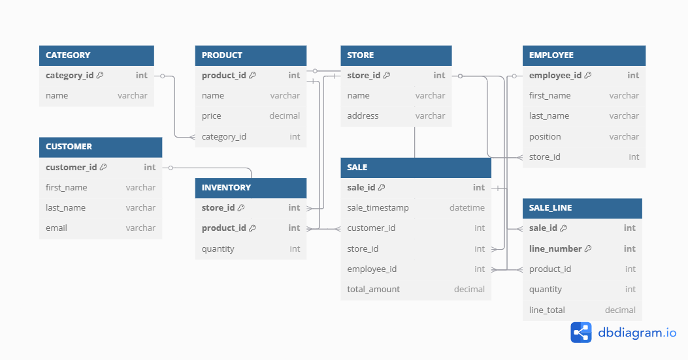

# Proyecto de Comparación de SQL vs NoSQL

## Objetivo

El objetivo de este proyecto es comparar el rendimiento de SQL y NoSQL en una base de datos de productos.

## Dominio de Datos
El Dominio de Datos que se eligió para este proyecto es el de un *Comercio Minorista*.

**¿Por qué es el más óptimo para este proyecto?**

- Transaccionalidad masiva sin esfuerzo
  - Generar 20 000+ ventas únicas con líneas de producto es trivial y realista.

- Agregaciones muy claras para BigQuery y dashboards
  - Ventas mensuales, top productos, top clientes, márgenes, etc. se entienden de inmediato y permiten gráficos convincentes.

- Modelo JSON elegante y profundo
  - Un documento “Factura” con array de líneas (Producto embebido → Categoría) alcanza >3 niveles orgánicamente.

- Modelo de grafo igualmente valioso
  - Camino Cliente–Compra–Producto–Categoría ofrece recomendaciones y consultas K-hop útiles; se pueden añadir Proveedor y Marca para profundizar.

- Menor complejidad “calendario/horario”
  - No hay que cuadrar horarios de clase ni asignar butacas; basta con fechas de venta y quizás hora.

- Abundancia de datos de referencia
  - Catálogos de productos (faker-commerce) y ejemplos de ventas permiten poblar rápidamente sin inconsistencias complicadas.

## Identificación de objetos clave
| Tipo                     | Nombre                        | Propósito                                                                         | Relaciones principales                                            |
| ------------------------ | ----------------------------- | --------------------------------------------------------------------------------- | ----------------------------------------------------------------- |
| **Entidad principal #1** | **Product**                   | Catálogo de artículos a la venta (precio unitario, …)                             | pertenece a **Category**; aparece en **Inventory** y **SaleLine** |
| **Entidad principal #2** | **Category**                  | Clasificación jerárquica (Electrónica, Hogar, …)                                  | contiene muchos **Product**                                       |
| **Entidad principal #3** | **Customer**                  | Comprador registrado                                                              | genera **Sale**                                                   |
| **Entidad principal #4** | **Store**                     | Sucursal física o canal en-línea                                                  | aloja **Employee**, mantiene **Inventory**, registra **Sale**     |
| **Entidad principal #5** | **Employee**                  | Vendedor / cajero que procesa la venta                                            | realiza **Sale** dentro de una **Store**                          |
| **Entidad puente**       | **Inventory** (Store-Product) | Rompe muchos-a-muchos *Store ↔ Product*; lleva cantidades en stock                | FK a **Store** y **Product**                                      |
| **Entidad puente**       | **SaleLine** (Sale-Product)   | Rompe muchos-a-muchos *Sale ↔ Product*; detalle de línea                          | FK a **Sale** y **Product**                                       |
| **Tabla transaccional**  | **Sale**                      | Operación de compra con **timestamp**; FK a **Customer**, **Store**, **Employee** | reúne las líneas en **SaleLine**                                  |

Con este conjunto cubrimos:
- ≥ 5 entidades principales
- ≥ 1 puente (en realidad dos)
- 1 tabla transaccional con marca de tiempo y FKs a todas las entidades clave.

## Diagrama Entidad-Relación

## Diagrama alternativo

