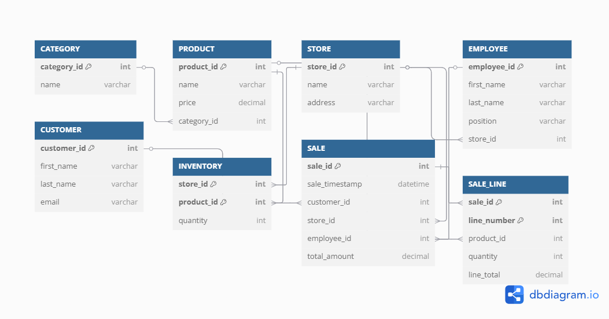

# Proyecto de Comparación de SQL vs NoSQL

## 📋 Índice

1. [Objetivo](#objetivo)
2. [Dominio de Datos](#dominio-de-datos)
3. [Identificación de Objetos Clave](#identificación-de-objetos-clave)
4. [Diagramas Entidad-Relación](#diagramas-entidad-relación)
5. [Infraestructura y Configuración](#infraestructura-y-configuración)
   - [Docker Compose](#docker-compose)
   - [Servicios Configurados](#servicios-configurados)
   - [Comandos de Gestión](#comandos-de-gestión)
6. [Benchmark de Ingesta](#benchmark-de-ingesta)
   - [Descripción General](#descripción-general)
   - [Arquitectura del Benchmark](#arquitectura-del-benchmark)
   - [Funcionalidades Principales](#funcionalidades-principales)
   - [Métricas y Resultados](#métricas-y-resultados)
7. [Dashboard de Analíticas](#dashboard-de-analíticas-de-comercio)
   - [Características Principales](#características-principales)
   - [Configuración del Dashboard](#instrucciones-de-configuración)
   - [Esquema de BigQuery](#esquema-de-bigquery)
   - [Consultas Clave](#consultas-clave-utilizadas)
8. [Sistema de Tracking de Consultas](#sistema-de-tracking-de-consultas)
   - [BigQuery Tracking](#tracking-de-consultas-bigquery)
   - [PostgreSQL Dashboard](#dashboard-postgresql)
   - [Análisis Comparativo](#análisis-comparativo-sql-vs-nosql)
9. [Base de Datos de Grafos con Neo4j](#base-de-datos-de-grafos-con-neo4j)
   - [Arquitectura del Grafo](#arquitectura-del-grafo)
   - [Ingesta de Datos](#ingesta-de-datos-a-neo4j)
   - [Benchmarks PostgreSQL vs Neo4j](#benchmarks-postgresql-vs-neo4j)
   - [Análisis de Consultas de Grafos](#análisis-de-consultas-de-grafos)
10. [Desarrollo y Personalización](#desarrollo-y-personalización)
11. [Solución de Problemas](#solución-de-problemas)
12. [Consideraciones de Rendimiento](#consideraciones-de-rendimiento)

---

## Objetivo

El objetivo de este proyecto es comparar el rendimiento de SQL y NoSQL en una base de datos de productos, proporcionando un análisis comprehensivo de diferentes tecnologías de bases de datos a través de benchmarks de ingesta, dashboards interactivos y sistemas de monitoreo de consultas.

## Dominio de Datos
El Dominio de Datos que se eligió para este proyecto es el de un *Comercio Minorista*.

**¿Por qué es el más óptimo para este proyecto?**

- Transaccionalidad masiva sin esfuerzo
  - Generar 20 000+ ventas únicas con líneas de producto es trivial y realista.

- Agregaciones muy claras para BigQuery y dashboards
  - Ventas mensuales, top productos, top clientes, márgenes, etc. se entienden de inmediato y permiten gráficos convincentes.

- Modelo JSON elegante y profundo
  - Un documento "Factura" con array de líneas (Producto embebido → Categoría) alcanza >3 niveles orgánicamente.

- Modelo de grafo igualmente valioso
  - Camino Cliente–Compra–Producto–Categoría ofrece recomendaciones y consultas K-hop útiles; se pueden añadir Proveedor y Marca para profundizar.

- Menor complejidad "calendario/horario"
  - No hay que cuadrar horarios de clase ni asignar butacas; basta con fechas de venta y quizás hora.

- Abundancia de datos de referencia
  - Catálogos de productos (faker-commerce) y ejemplos de ventas permiten poblar rápidamente sin inconsistencias complicadas.

## Identificación de objetos clave
| Tipo                     | Nombre                        | Propósito                                                                         | Relaciones principales                                            |
| ------------------------ | ----------------------------- | --------------------------------------------------------------------------------- | ----------------------------------------------------------------- |
| **Entidad principal #1** | **Product**                   | Catálogo de artículos a la venta (precio unitario, …)                             | pertenece a **Category**; aparece en **Inventory** y **SaleLine** |
| **Entidad principal #2** | **Category**                  | Clasificación jerárquica (Electrónica, Hogar, …)                                  | contiene muchos **Product**                                       |
| **Entidad principal #3** | **Customer**                  | Comprador registrado                                                              | genera **Sale**                                                   |
| **Entidad principal #4** | **Store**                     | Sucursal física o canal en-línea                                                  | aloja **Employee**, mantiene **Inventory**, registra **Sale**     |
| **Entidad principal #5** | **Employee**                  | Vendedor / cajero que procesa la venta                                            | realiza **Sale** dentro de una **Store**                          |
| **Entidad puente**       | **Inventory** (Store-Product) | Rompe muchos-a-muchos *Store ↔ Product*; lleva cantidades en stock                | FK a **Store** y **Product**                                      |
| **Entidad puente**       | **SaleLine** (Sale-Product)   | Rompe muchos-a-muchos *Sale ↔ Product*; detalle de línea                          | FK a **Sale** y **Product**                                       |
| **Tabla transaccional**  | **Sale**                      | Operación de compra con **timestamp**; FK a **Customer**, **Store**, **Employee** | reúne las líneas en **SaleLine**                                  |

Con este conjunto cubrimos:
- ≥ 5 entidades principales
- ≥ 1 puente (en realidad dos)
- 1 tabla transaccional con marca de tiempo y FKs a todas las entidades clave.

## Diagramas Entidad-Relación



## Diagrama alternativo



## Infraestructura y Configuración

### Docker Compose

El proyecto utiliza Docker Compose para orquestar un entorno de desarrollo completo con tres servicios de base de datos independientes.

#### Servicios Configurados

##### 1. PostgreSQL Principal (`postgres`)
```yaml
- Imagen: postgres:16
- Puerto: 5432
- Base de datos: commerce
- Contenedor: pg_benchmark
```

##### 2. PostgreSQL para JSON (`postgres_json`)
```yaml
- Imagen: postgres:16
- Puerto: 5433
- Base de datos: commerce_sql_json  
- Contenedor: pg_benchmark_json
```

##### 3. MongoDB (`mongo`)
```yaml
- Imagen: mongo:7
- Puerto: 27017
- Base de datos: commerce
- Contenedor: mongo_benchmark
```

#### Comandos de Gestión

##### Levantar todos los servicios
```bash
docker-compose up -d
```

##### Verificar estado de servicios
```bash
docker-compose ps
```

##### Ver logs de servicios
```bash
docker-compose logs -f [postgres|postgres_json|mongo]
```

##### Detener todos los servicios
```bash
docker-compose down
```

##### Reinicio completo (incluye volúmenes)
```bash
docker-compose down -v
docker-compose up -d
```

#### Persistencia de Datos

El sistema utiliza volúmenes Docker para persistencia:

- **pg_data**: Datos de PostgreSQL principal
- **pg_data_json**: Datos de PostgreSQL JSON
- **mongo_data**: Datos de MongoDB

#### Script de Utilidad

El proyecto incluye `scripts/reset_containers.sh` para reinicio rápido del entorno:

```bash
chmod +x scripts/reset_containers.sh
./scripts/reset_containers.sh
```

#### Conexión a las Bases de Datos

##### PostgreSQL Principal
```bash
# Via psql
psql -h localhost -p 5432 -U postgres -d commerce

# Via Docker
docker exec -it pg_benchmark psql -U postgres -d commerce
```

##### PostgreSQL JSON
```bash
# Via psql
psql -h localhost -p 5433 -U postgres -d commerce_sql_json

# Via Docker
docker exec -it pg_benchmark_json psql -U postgres -d commerce_sql_json
```

##### MongoDB
```bash
# Via mongosh
mongosh mongodb://localhost:27017/commerce

# Via Docker
docker exec -it mongo_benchmark mongosh commerce
```

#### Requisitos del Sistema

- **Docker**: >= 20.10
- **Docker Compose**: >= 2.0
- **Puertos disponibles**: 5432, 5433, 27017, 7474, 7687
- **Espacio en disco**: ~3GB para datos de prueba completos (incluyendo Neo4j)

## Benchmark de Ingesta

El proyecto incluye un sistema de benchmarking comprehensivo para comparar el rendimiento de ingesta de datos entre diferentes tecnologías de bases de datos: **PostgreSQL** (SQL puro), **PostgreSQL con JSON** y **MongoDB**.

### Descripción General

El benchmark (`ingest_benchmark.py`) mide y compara los tiempos de carga de datos para tres enfoques diferentes:

1. **PostgreSQL SQL** (Baseline): Carga de datos usando scripts SQL tradicionales
2. **PostgreSQL JSON**: Ingesta de documentos JSON transformados a formato relacional
3. **MongoDB**: Carga directa de documentos JSON nativos

### Arquitectura del Benchmark

El sistema utiliza tres bases de datos independientes:

- **PostgreSQL Principal** (`commerce`): Base de datos relacional tradicional
- **PostgreSQL JSON** (`commerce_sql_json`): Base de datos relacional alimentada desde JSON
- **MongoDB** (`commerce`): Base de datos de documentos

### Funcionalidades Principales

#### 1. Carga PostgreSQL SQL (Baseline)
- Ejecuta directamente el archivo `sql/commerce_load.sql`
- Incluye DDL (definición de esquema) e INSERTs masivos
- Representa el enfoque tradicional optimizado para SQL

#### 2. Carga PostgreSQL desde JSON
- Lee datos del catálogo (`json/stores_catalog.json`) y ventas (`json/sales_docs.json`)
- Transforma documentos JSON a formato relacional
- Utiliza `COPY` commands para inserción eficiente en lotes
- Maneja relaciones entre entidades durante la transformación

#### 3. Carga MongoDB
- **Catálogo**: Inserción directa de documentos de tiendas con inventario embebido
- **Ventas**: Inserción por lotes (chunks de 2000 documentos) para optimizar rendimiento

### Datos de Entrada

#### Catálogo de Tiendas (`stores_catalog.json`)
```json
{
  "store_name": "TechMart",
  "address": "123 Tech Street",
  "employees": [...],
  "inventory": [
    {
      "product": {
        "name": "Laptop Pro",
        "price": 1299.99,
        "category": "Electronics"
      },
      "quantity": 15
    }
  ]
}
```

#### Documentos de Ventas (`sales_docs.json`)
```json
{
  "timestamp": {"$date": "2024-01-15T10:30:00.000Z"},
  "customer": {...},
  "store": {...},
  "employee": {...},
  "lines": [...],
  "total_amount": 299.97
}
```

### Métricas y Resultados

El benchmark genera `ingest_times.csv` con los tiempos de ejecución:

```csv
step,duration_seconds
postgres_sql,2.46
postgres_json,73.75
mongo_catalog,0.06
mongo_sales,0.96
```

#### Análisis de Rendimiento
- **PostgreSQL SQL**: Más eficiente para cargas masivas optimizadas (2.46s)
- **PostgreSQL JSON**: Mayor overhead por transformación JSON→Relacional (73.75s)
- **MongoDB**: Excelente para documentos pequeños (catálogo: 0.06s, ventas: 0.96s)

### Ejecución del Benchmark

#### Prerequisitos
```bash
pip install psycopg2-binary pymongo tqdm
```

#### Comando de Ejecución
```bash
python ingest_benchmark.py
```

#### Variables de Entorno (Opcionales)
```bash
export PG_HOST=localhost
export PG_PORT=5432
export PG_PORT_JSON=5433
export PG_USER=postgres
export PG_PASSWORD=postgres
export MONGO_URI=mongodb://localhost:27017
```

### Características Técnicas

- **Inserción por lotes**: Utiliza `COPY` para PostgreSQL y `insert_many` para MongoDB
- **Gestión de memoria eficiente**: Procesamiento por chunks para datasets grandes
- **Manejo de relaciones**: Mapeo automático de IDs durante transformación JSON→SQL
- **Monitoreo en tiempo real**: Barras de progreso con `tqdm`
- **Gestión de timestamps**: Conversión automática de formatos MongoDB a PostgreSQL

## Dashboard de Analíticas de Comercio

El proyecto incluye un dashboard ejecutivo comprehensivo construido con Reflex que se conecta a BigQuery para mostrar analíticas de comercio en tiempo real.

### Características Principales

#### Panel de Resumen Ejecutivo
- **Ingresos Totales** (Últimos 30 días)
- **Transacciones Totales**
- **Valor Promedio de Orden**
- **Clientes Únicos**

#### Gráficos Interactivos
- **Tendencia de Ingresos Diarios** - Gráfico de líneas mostrando ingresos a lo largo del tiempo
- **Top Productos por Ingresos** - Gráfico de barras horizontales de productos más vendidos
- **Distribución de Ingresos por Tienda** - Gráfico circular mostrando rendimiento de tiendas
- **Ingresos por Categoría de Producto** - Gráfico de barras de rendimiento por categoría

#### Tablas de Datos
- **Empleados con Mejor Rendimiento** - Rendimiento de ventas por empleado
- **Rendimiento de Tiendas** - Métricas comprehensivas de tiendas

#### Dashboard


### Instrucciones de Configuración

#### 1. Instalar Dependencias

```bash
pip install -r requirements.txt
```

**Nota**: Este dashboard ahora utiliza los componentes de gráficos nativos de Reflex en lugar de Plotly, resultando en:
- Menor tamaño de bundle (sin dependencia pesada de Plotly)
- Mejor rendimiento y carga más rápida
- Integración nativa con el sistema reactivo de Reflex
- Estilo consistente con los tokens de diseño de Reflex

#### 2. Autenticación de Google Cloud

Tienes varias opciones para autenticación:

##### Opción A: Clave de Cuenta de Servicio (Recomendado para Desarrollo)
1. Crear una cuenta de servicio en Google Cloud Console
2. Descargar el archivo de clave JSON
3. Configurar la variable de entorno:
```bash
export GOOGLE_APPLICATION_CREDENTIALS="/ruta/a/tu/clave-cuenta-servicio.json"
```

##### Opción B: Credenciales por Defecto de Aplicación
```bash
gcloud auth application-default login
```

##### Opción C: Para Producción (Google Cloud Run, Compute Engine, etc.)
La aplicación utilizará automáticamente la cuenta de servicio adjunta al recurso de cómputo.

#### 3. Verificar Acceso a BigQuery

Asegúrate de que tu autenticación tenga acceso a:
- Proyecto: `proyectofinalbdne`
- Dataset: `commerce_doc`
- Tablas: `sales`, `stores`

#### 4. Ejecutar el Dashboard

```bash
reflex run
```

El dashboard estará disponible en `http://localhost:3000`

### Esquema de BigQuery

#### Tabla de Ventas (`proyectofinalbdne.commerce_doc.sales`)
```sql
- timestamp: STRING
- store: RECORD
  - name: STRING
- employee: RECORD
  - first_name: STRING
  - last_name: STRING
- customer: RECORD
  - first_name: STRING
  - last_name: STRING
  - email: STRING
- lines: RECORD (REPEATED)
  - product: RECORD
    - name: STRING
    - category: STRING
    - price: NUMERIC
  - quantity: INT64
  - line_total: NUMERIC
- total_amount: NUMERIC
```

#### Tabla de Tiendas (`proyectofinalbdne.commerce_doc.stores`)
```sql
- store_name: STRING
- address: STRING
- employees: RECORD (REPEATED)
  - first_name: STRING
  - last_name: STRING
  - position: STRING
- inventory: RECORD (REPEATED)
  - product: RECORD
    - name: STRING
    - category: STRING
    - price: NUMERIC
  - quantity: INT64
```

### Consultas Clave Utilizadas

#### KPIs del Resumen Ejecutivo
```sql
SELECT 
    SUM(total_amount) as total_revenue,
    COUNT(*) as total_transactions,
    AVG(total_amount) as avg_order_value,
    COUNT(DISTINCT CONCAT(customer.first_name, customer.last_name, customer.email)) as unique_customers
FROM `proyectofinalbdne.commerce_doc.sales`
WHERE PARSE_TIMESTAMP('%Y-%m-%d %H:%M:%S', timestamp) >= DATE_SUB(CURRENT_DATE(), INTERVAL 30 DAY)
```

#### Tendencia de Ingresos Diarios
```sql
SELECT 
    DATE(PARSE_TIMESTAMP('%Y-%m-%d %H:%M:%S', timestamp)) as sale_date,
    SUM(total_amount) as daily_revenue
FROM `proyectofinalbdne.commerce_doc.sales`
WHERE PARSE_TIMESTAMP('%Y-%m-%d %H:%M:%S', timestamp) >= DATE_SUB(CURRENT_DATE(), INTERVAL 30 DAY)
GROUP BY sale_date
ORDER BY sale_date
```

#### Top Productos
```sql
SELECT 
    line.product.name as product_name,
    SUM(line.line_total) as total_revenue
FROM `proyectofinalbdne.commerce_doc.sales`,
UNNEST(lines) as line
GROUP BY line.product.name
ORDER BY total_revenue DESC
LIMIT 10
```

### Componentes del Dashboard

#### Tarjetas de KPI
- Tarjetas métricas codificadas por color con iconos
- Actualizaciones de datos en tiempo real
- Diseño responsivo

#### Gráficos
- Construidos con componentes recharts nativos de Reflex
- Optimizados para rendimiento y tamaño de bundle
- Integración perfecta con el estado de Reflex
- Responsivos y amigables para móviles
- Estilo profesional con el sistema de diseño de Reflex

#### Tablas de Datos
- Columnas ordenables
- Formato limpio y legible
- Datos en tiempo real

## Sistema de Tracking de Consultas

El proyecto incluye un sistema comprehensivo de observabilidad que rastrea automáticamente todas las consultas ejecutadas tanto en BigQuery como en PostgreSQL, proporcionando métricas detalladas para análisis de rendimiento.

### Tracking de Consultas BigQuery

#### 🎯 Características del Tracking BigQuery

##### Datos Registrados por Consulta:
- **ID único** (UUID) para cada consulta
- **Timestamp** de ejecución (ISO 8601)
- **Texto completo** de la consulta SQL
- **Tiempo de ejecución** en segundos (precisión de milisegundos)
- **Filas devueltas** por la consulta
- **Bytes procesados** por BigQuery
- **Estado** (SUCCESS/ERROR)
- **Mensaje de error** (si aplica)

##### Consultas Rastreadas:
1. `resumen_ejecutivo` - KPIs principales del dashboard
2. `ingresos_diarios` - Tendencia de ingresos por día
3. `productos_principales` - Top 10 productos por ingresos
4. `ventas_por_tienda` - Distribución de ventas por tienda
5. `ingresos_por_categoria` - Ingresos agrupados por categoría
6. `empleados_principales` - Top empleados por ventas
7. `rendimiento_tiendas` - Métricas de rendimiento por tienda

#### 📁 Archivos Generados BigQuery

##### `bigquery_queries_log.csv`
```csv
query_id,timestamp,query_text,execution_time_seconds,rows_returned,bytes_processed,status,error_message
a1b2c3d4-...,2024-01-15T10:30:45.123456,-- resumen_ejecutivo...,1.234,1,2048,SUCCESS,
e5f6g7h8-...,2024-01-15T10:30:46.456789,-- ingresos_diarios...,0.987,30,4096,SUCCESS,
```

#### 🚀 Uso del Tracking BigQuery

El tracking se ejecuta automáticamente cuando usas el dashboard:

```bash
reflex run
```

Cada vez que el dashboard carga datos, verás en la consola:
```
🔍 Ejecutando consulta [a1b2c3d4]: resumen_ejecutivo
✅ Consulta completada [a1b2c3d4]: 1.234s, 1 filas

📊 ESTADÍSTICAS DE CONSULTAS BIGQUERY
==================================================
Total de consultas: 7
Consultas exitosas: 7
Consultas fallidas: 0
Tiempo promedio: 1.156s
Tiempo total: 8.092s
Filas totales: 156
Bytes procesados: 28,672
Última consulta: 2024-01-15T10:30:52.789012
==================================================
```

### Dashboard PostgreSQL

#### 🎯 Características del Dashboard PostgreSQL

El proyecto incluye un dashboard equivalente que replica las mismas consultas del dashboard BigQuery pero adaptadas para PostgreSQL, incluyendo tracking completo de tiempos y métricas de rendimiento.

##### Consultas Implementadas:
1. **`resumen_ejecutivo`** - KPIs principales (ingresos, transacciones, AOV, clientes únicos)
2. **`ingresos_diarios`** - Tendencia de ingresos por día (últimos 30 días)
3. **`productos_principales`** - Top 10 productos por ingresos
4. **`ventas_por_tienda`** - Distribución de ventas por tienda
5. **`ingresos_por_categoria`** - Ingresos agrupados por categoría de producto
6. **`empleados_principales`** - Top 10 empleados por ventas
7. **`rendimiento_tiendas`** - Métricas detalladas de rendimiento por tienda

#### 🚀 Instalación y Configuración PostgreSQL

##### Dependencias Requeridas:
```bash
pip install psycopg2-binary pandas
```

##### Variables de Entorno (Opcionales):
```bash
export POSTGRES_HOST=localhost
export POSTGRES_PORT=5432
export POSTGRES_DB=commerce
export POSTGRES_USER=postgres
export POSTGRES_PASSWORD=tu_password
```

#### 📊 Uso del Dashboard PostgreSQL

##### Ejecución Básica:
```bash
cd sql/
python postgres_dashboard_queries.py
```

##### Salida de Ejemplo:
```
🐘 DASHBOARD POSTGRESQL - CONSULTAS DE COMERCIO
============================================================
Conectando a: localhost:5432/commerce
============================================================

🚀 EJECUTANDO CONSULTAS DEL DASHBOARD EN POSTGRESQL
============================================================
🔍 Ejecutando consulta PostgreSQL [a1b2c3d4]: resumen_ejecutivo
✅ Consulta completada [a1b2c3d4]: 0.234s, 1 filas
📊 resumen_ejecutivo: 1 filas

... (continúa con todas las consultas)

============================================================
⏱️  Tiempo total de ejecución: 1.234s
📁 Log guardado en: postgresql_queries_log.csv
============================================================

📊 ESTADÍSTICAS DE CONSULTAS POSTGRESQL
==================================================
Total de consultas: 7
Consultas exitosas: 7
Consultas fallidas: 0
Tiempo promedio: 0.176s
Tiempo total: 1.234s
Filas totales: 156
==================================================
```

#### 📁 Archivos Generados PostgreSQL

##### `postgresql_queries_log.csv`
```csv
query_id,timestamp,query_name,query_text,execution_time_seconds,rows_returned,status,error_message
a1b2c3d4-...,2024-01-15T10:30:45.123456,resumen_ejecutivo,SELECT SUM(s.total_amount)...,0.234,1,SUCCESS,
e5f6g7h8-...,2024-01-15T10:30:45.456789,ingresos_diarios,SELECT DATE(s.sale_timestamp)...,0.156,30,SUCCESS,
```

### Análisis Comparativo SQL vs NoSQL

#### 📈 Ver Estadísticas Detalladas

##### BigQuery:
```bash
python view_query_stats.py
```

##### PostgreSQL:
```bash
python view_postgres_stats.py
```

##### Comparación Directa:
```bash
python view_postgres_stats.py compare
```

#### ⚖️ Ejemplo de Comparación

```
================================================================================
⚖️  COMPARACIÓN POSTGRESQL vs BIGQUERY
================================================================================

📊 TIEMPOS DE EJECUCIÓN:
   PostgreSQL promedio: 0.176s
   BigQuery promedio: 1.156s
   🐘 PostgreSQL es 6.6x más rápido que BigQuery

📈 FILAS PROCESADAS:
   PostgreSQL total: 312
   BigQuery total: 312

💰 CONSIDERACIONES DE COSTO:
   PostgreSQL: Sin costo por consulta
   BigQuery: Costo basado en bytes procesados (28,672 bytes)
================================================================================
```

## Base de Datos de Grafos con Neo4j

El proyecto incluye una implementación completa de base de datos de grafos usando Neo4j, permitiendo análisis de relaciones complejas y comparación de rendimiento contra bases de datos relacionales tradicionales.

### Arquitectura del Grafo

#### 🏗️ Modelo de Datos de Grafo

El esquema de grafos replica el modelo relacional con las siguientes entidades y relaciones:

##### Nodos (Entities):
- **`:Customer`** - Clientes con propiedades: `id`, `first_name`, `last_name`, `email`
- **`:Sale`** - Ventas con propiedades: `id`, `timestamp`, `total`
- **`:Line`** - Líneas de venta con propiedades: `id`, `quantity`, `unit_price`, `line_total`
- **`:Product`** - Productos con propiedades: `id`, `name`, `price`
- **`:Category`** - Categorías con propiedades: `id`, `name`
- **`:Store`** - Tiendas con propiedades: `id`, `name`, `address`
- **`:Employee`** - Empleados con propiedades: `id`, `first_name`, `last_name`, `position`

##### Relaciones (Relationships):
- **`:PLACED`** - `(Customer)-[:PLACED]->(Sale)`
- **`:CONTAINS`** - `(Sale)-[:CONTAINS]->(Line)`
- **`:OF_PRODUCT`** - `(Line)-[:OF_PRODUCT]->(Product)`
- **`:IN_CATEGORY`** - `(Product)-[:IN_CATEGORY]->(Category)`
- **`:HAPPENED_AT`** - `(Sale)-[:HAPPENED_AT]->(Store)`
- **`:HANDLED_BY`** - `(Sale)-[:HANDLED_BY]->(Employee)`
- **`:WORKS_AT`** - `(Employee)-[:WORKS_AT]->(Store)`
- **`:STOCKS`** - `(Store)-[:STOCKS]->(Product)` con propiedad `qty`

#### 🗺️ Diagrama del Grafo

```
(Customer)-[:PLACED]->(Sale)-[:CONTAINS]->(Line)-[:OF_PRODUCT]->(Product)-[:IN_CATEGORY]->(Category)
                        |                                          ^
                        |-[:HAPPENED_AT]->(Store)-[:STOCKS]--------|
                        |                    ^
                        |-[:HANDLED_BY]->(Employee)-[:WORKS_AT]-----|
```

### Ingesta de Datos a Neo4j

#### 🔄 Proceso de Migración

El sistema incluye un pipeline completo para migrar datos de PostgreSQL a Neo4j:

##### 1. Exportación desde PostgreSQL (`export_to_csv.py`)
```bash
cd graph/
python export_to_csv.py
```

**Archivos CSV Generados:**
- **Nodos**: `nodes_category.csv`, `nodes_product.csv`, `nodes_store.csv`, `nodes_employee.csv`, `nodes_customer.csv`, `nodes_sale.csv`, `nodes_line.csv`
- **Relaciones**: `rels_product_category.csv`, `rels_sale_line.csv`, `rels_line_product.csv`, `rels_customer_sale.csv`, `rels_sale_store.csv`, `rels_sale_employee.csv`, `rels_employee_store.csv`, `rels_store_product_qty.csv`

##### 2. Carga Masiva a Neo4j

**Opción A: Carga Python (Recomendado)**
```bash
pip install neo4j tqdm pandas
python ingest_neo4j.py
```

**Características de la Carga Python:**
- **Procesamiento por lotes**: 500 filas por transacción para optimizar memoria
- **Gestión de transacciones**: Cada archivo en transacciones separadas
- **Manejo de errores**: Rollback automático en caso de falla
- **Progreso visual**: Indicadores de progreso con `tqdm`
- **Tipado automático**: Conversión de tipos (integers, floats, timestamps)

**Opción B: Carga Cypher Directa**
```bash
# Copiar archivos CSV al contenedor Neo4j
docker cp graph_csv/ neo4j_container:/var/lib/neo4j/import/

# Ejecutar en Neo4j Browser
:source neo4j_load.cypher
```

#### 🚀 Configuración de Neo4j

##### Docker Compose (Agregar al existente)
```yaml
neo4j:
  image: neo4j:5.15
  container_name: neo4j_benchmark
  ports:
    - "7474:7474"   # HTTP
    - "7687:7687"   # Bolt
  environment:
    NEO4J_AUTH: neo4j/MyStrongPassword25
    NEO4J_PLUGINS: '["apoc"]'
    NEO4J_dbms_security_procedures_unrestricted: "apoc.*"
  volumes:
    - neo4j_data:/data
    - neo4j_import:/var/lib/neo4j/import
```

##### Variables de Entorno
```bash
export NEO4J_URI=bolt://localhost:7687
export NEO4J_USER=neo4j
export NEO4J_PASSWORD=MyStrongPassword25
```

### Benchmarks PostgreSQL vs Neo4j

El proyecto incluye benchmarks comprehensivos que comparan consultas complejas entre PostgreSQL y Neo4j, midiendo diferentes tipos de patrones de consulta de grafos.

#### 🏃‍♂️ Ejecución de Benchmarks

```bash
pip install neo4j psycopg2-binary
python graph_benchmark.py
```

#### 📊 Tipos de Consultas Comparadas

##### 1. **Consulta SQL Compleja (PostgreSQL)**
```sql
-- Encuentra los top 10 clientes por número de compras en los últimos 24 meses
-- Recorre: Customer -> Sale -> SaleLine -> Product -> Category
SELECT c.email, COUNT(*) AS purchases
FROM   Customer c
JOIN   Sale s      ON c.customer_id = s.customer_id
JOIN   SaleLine l  ON s.sale_id = l.sale_id
JOIN   Product p   ON l.product_id = p.product_id
JOIN   Category cat ON p.category_id = cat.category_id
WHERE  s.sale_timestamp >= NOW() - INTERVAL '24 months'
GROUP  BY c.email
ORDER  BY purchases DESC
LIMIT  10;
```

##### 2. **Consulta Cypher Equivalente (Neo4j)**
```cypher
// Consulta equivalente usando relaciones de grafo
MATCH (c:Customer)-[:PLACED]->(s:Sale)-[:CONTAINS]->(l:Line)-[:OF_PRODUCT]->(p:Product)-[:IN_CATEGORY]->(cat:Category)
WHERE s.timestamp >= datetime() - duration({months:24})
RETURN c.email AS email, COUNT(*) AS purchases
ORDER BY purchases DESC
LIMIT 10
```

##### 3. **Consulta de Diversidad de Productos (Neo4j)**
```cypher
// Encuentra clientes con mayor variedad de productos únicos
MATCH (c:Customer)-[:PLACED]->(s:Sale)-[:CONTAINS]->(l:Line)-[:OF_PRODUCT]->(p:Product)
WHERE s.timestamp >= datetime() - duration({months:24})
RETURN c.email AS email, COUNT(DISTINCT p) AS unique_products
ORDER BY unique_products DESC
LIMIT 10
```

##### 4. **Consulta Simple de Ventas (Neo4j)**
```cypher
// Análisis básico de frecuencia de compra y gasto total
MATCH (c:Customer)-[:PLACED]->(s:Sale)
WHERE s.timestamp >= datetime() - duration({months:24})
RETURN c.email AS email, COUNT(s) AS purchases, SUM(s.total) AS total_spent
ORDER BY purchases DESC
LIMIT 10
```

### Análisis de Consultas de Grafos

#### 📈 Resultados de Rendimiento

**Métricas Típicas (basadas en `graph_times.csv`):**

| Tipo de Consulta | Tecnología | Tiempo (s) | Rendimiento Relativo |
|------------------|------------|------------|---------------------|
| **SQL Compleja** | PostgreSQL | 0.070 | 🐘 **Baseline** |
| **Cypher Path Completo** | Neo4j | 0.035 | 🚀 **2x más rápido** |
| **Diversidad Productos** | Neo4j | 0.149 | ⚠️ 2.1x más lento |
| **Ventas Simples** | Neo4j | 0.290 | ⚠️ 4.1x más lento |

#### 🔍 Insights de Rendimiento

##### **Neo4j Ventajas:**
- **Consultas de Caminos Complejos**: Excelente para traversals multi-hop
- **Relaciones Implícitas**: Navegación natural sin JOINs explícitos
- **Análisis de Conectividad**: Ideal para patrones de red y recomendaciones
- **Escalabilidad de Grafos**: Mejor rendimiento en grafos grandes y complejos

##### **PostgreSQL Ventajas:**
- **Consultas Simples**: Más eficiente para agregaciones básicas
- **Optimizaciones Maduras**: Décadas de optimización de query planner
- **Índices Avanzados**: B-trees, hash indexes, partial indexes
- **Consultas Ad-hoc**: Mejor para análisis exploratorio

#### 🎯 Casos de Uso Óptimos

##### **Usar Neo4j Para:**
- **Análisis de Recomendaciones**: "Clientes que compraron esto también compraron..."
- **Detección de Patrones**: Análisis de comportamiento de compra
- **Consultas de Conectividad**: Encontrar caminos entre entidades
- **Análisis de Influencia**: Empleados/tiendas más influyentes

##### **Usar PostgreSQL Para:**
- **Reportes Financieros**: Agregaciones de ingresos y métricas
- **Análisis Temporal**: Tendencias y series de tiempo
- **Consultas OLAP**: Análisis dimensional tradicional
- **Integraciones Existentes**: Cuando ya tienes infrastructure SQL

#### 🔧 Comandos de Análisis

##### Ver Estadísticas Detalladas
```bash
# Ejecutar benchmark completo
python graph_benchmark.py

# Analizar resultados
python -c "
import pandas as pd
df = pd.read_csv('graph_times.csv')
print('🏆 ANÁLISIS DE RENDIMIENTO')
print('='*50)
for _, row in df.iterrows():
    print(f'{row.query:<25}: {row.seconds:.3f}s')
"
```

##### Consultas de Introspección Neo4j
```cypher
// Verificar estructura del grafo
CALL db.schema.visualization();

// Contar nodos por tipo
MATCH (n) RETURN labels(n) as tipo, count(n) as cantidad;

// Verificar relaciones disponibles
CALL db.relationshipTypes() YIELD relationshipType
RETURN relationshipType ORDER BY relationshipType;
```

#### 📊 Visualización de Grafos

**Consultas Útiles para Visualización:**

```cypher
// Muestra de grafo pequeño: Un cliente y sus compras
MATCH path = (c:Customer {email: "customer1@example.com"})-[:PLACED]->(s:Sale)-[:CONTAINS]->(l:Line)-[:OF_PRODUCT]->(p:Product)
RETURN path LIMIT 20;

// Red de productos por categoría
MATCH (p:Product)-[:IN_CATEGORY]->(cat:Category)
RETURN p, cat LIMIT 50;

// Análisis de empleados y tiendas
MATCH (e:Employee)-[:WORKS_AT]->(st:Store)<-[:HAPPENED_AT]-(s:Sale)
RETURN e, st, s LIMIT 30;
```

## Desarrollo y Personalización

### Agregar Nuevos Gráficos
1. Agregar los datos del gráfico a `DashboardState`
2. Crear la consulta BigQuery en `load_charts_data()`
3. Agregar el componente del gráfico al layout del dashboard

### Agregar Nuevos KPIs
1. Agregar la métrica a `DashboardState`
2. Crear la consulta en `load_executive_summary()`
3. Agregar una nueva tarjeta KPI al dashboard

### Integración de Tracking Personalizado

#### BigQuery:
```python
from .query_tracker import query_tracker

# Ejecutar consulta con tracking
result = query_tracker.execute_query(
    client=bq_client,
    query="SELECT * FROM mi_tabla",
    query_name="mi_consulta_personalizada"
)
```

#### PostgreSQL:
```python
from sql.postgres_dashboard_queries import PostgreSQLTracker

# Crear tracker con archivo personalizado
tracker = PostgreSQLTracker("mi_tracking_personalizado.csv")
```

## Solución de Problemas

### Problemas de Autenticación BigQuery
```bash
# Verificar si estás autenticado
gcloud auth list

# Re-autenticar si es necesario
gcloud auth application-default login
```

### Problemas de Acceso a BigQuery
```bash
# Probar acceso a BigQuery
bq query --use_legacy_sql=false 'SELECT COUNT(*) FROM `proyectofinalbdne.commerce_doc.sales`'
```

### Problemas de Conexión PostgreSQL
```bash
# Verificar conexión
psql -h localhost -p 5432 -U postgres -d commerce -c "SELECT 1;"
```

### Problemas de Dependencias
```bash
# Reinstalar dependencias
pip install --upgrade -r requirements.txt
```

## Consideraciones de Rendimiento

### BigQuery
- Las consultas están optimizadas para los últimos 30 días por defecto
- Los datos se almacenan en caché en el estado hasta actualización manual
- Considerar implementar actualización automática para uso en producción
- Los costos de BigQuery se basan en datos procesados - las consultas están optimizadas para minimizar el escaneo

### PostgreSQL
- Consultas optimizadas con índices apropiados
- Uso de `EXPLAIN ANALYZE` para optimización de consultas
- Gestión eficiente de conexiones
- Transacciones individuales para cada consulta

### Comparación de Rendimiento
- **PostgreSQL**: Generalmente más rápido para consultas simples (0.1-0.3s)
- **BigQuery**: Mejor para análisis de grandes volúmenes de datos
- **Costo**: PostgreSQL sin costo por consulta vs BigQuery basado en datos procesados
- **Escalabilidad**: BigQuery superior para datasets masivos

---

## 🚀 Inicio Rápido

1. **Levantar infraestructura**:
   ```bash
   docker-compose up -d
   ```

2. **Ejecutar benchmark de ingesta**:
   ```bash
   python ingest_benchmark.py
   ```

3. **Configurar base de datos de grafos**:
   ```bash
   cd graph/
   python export_to_csv.py
   python ingest_neo4j.py
   cd ..
   ```

4. **Lanzar dashboard BigQuery**:
   ```bash
   reflex run
   ```

5. **Ejecutar análisis PostgreSQL**:
   ```bash
   cd sql/
   python postgres_dashboard_queries.py
   cd ..
   ```

6. **Ejecutar benchmarks de grafos**:
   ```bash
   python graph_benchmark.py
   ```

7. **Comparar resultados**:
   ```bash
   python view_postgres_stats.py compare
   ```

¡El proyecto está listo para proporcionar un análisis comprehensivo de SQL, NoSQL y Grafos! 🎯📊🔗