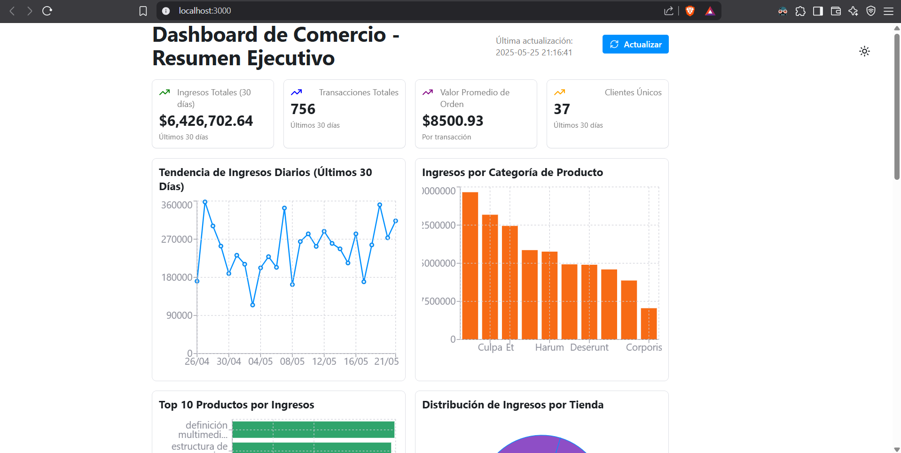
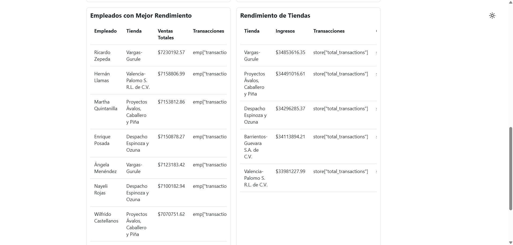

# Proyecto de Comparación de SQL vs NoSQL

## Objetivo

El objetivo de este proyecto es comparar el rendimiento de SQL y NoSQL en una base de datos de productos.

## Dominio de Datos
El Dominio de Datos que se eligió para este proyecto es el de un *Comercio Minorista*.

**¿Por qué es el más óptimo para este proyecto?**

- Transaccionalidad masiva sin esfuerzo
  - Generar 20 000+ ventas únicas con líneas de producto es trivial y realista.

- Agregaciones muy claras para BigQuery y dashboards
  - Ventas mensuales, top productos, top clientes, márgenes, etc. se entienden de inmediato y permiten gráficos convincentes.

- Modelo JSON elegante y profundo
  - Un documento "Factura" con array de líneas (Producto embebido → Categoría) alcanza >3 niveles orgánicamente.

- Modelo de grafo igualmente valioso
  - Camino Cliente–Compra–Producto–Categoría ofrece recomendaciones y consultas K-hop útiles; se pueden añadir Proveedor y Marca para profundizar.

- Menor complejidad "calendario/horario"
  - No hay que cuadrar horarios de clase ni asignar butacas; basta con fechas de venta y quizás hora.

- Abundancia de datos de referencia
  - Catálogos de productos (faker-commerce) y ejemplos de ventas permiten poblar rápidamente sin inconsistencias complicadas.

## Identificación de objetos clave
| Tipo                     | Nombre                        | Propósito                                                                         | Relaciones principales                                            |
| ------------------------ | ----------------------------- | --------------------------------------------------------------------------------- | ----------------------------------------------------------------- |
| **Entidad principal #1** | **Product**                   | Catálogo de artículos a la venta (precio unitario, …)                             | pertenece a **Category**; aparece en **Inventory** y **SaleLine** |
| **Entidad principal #2** | **Category**                  | Clasificación jerárquica (Electrónica, Hogar, …)                                  | contiene muchos **Product**                                       |
| **Entidad principal #3** | **Customer**                  | Comprador registrado                                                              | genera **Sale**                                                   |
| **Entidad principal #4** | **Store**                     | Sucursal física o canal en-línea                                                  | aloja **Employee**, mantiene **Inventory**, registra **Sale**     |
| **Entidad principal #5** | **Employee**                  | Vendedor / cajero que procesa la venta                                            | realiza **Sale** dentro de una **Store**                          |
| **Entidad puente**       | **Inventory** (Store-Product) | Rompe muchos-a-muchos *Store ↔ Product*; lleva cantidades en stock                | FK a **Store** y **Product**                                      |
| **Entidad puente**       | **SaleLine** (Sale-Product)   | Rompe muchos-a-muchos *Sale ↔ Product*; detalle de línea                          | FK a **Sale** y **Product**                                       |
| **Tabla transaccional**  | **Sale**                      | Operación de compra con **timestamp**; FK a **Customer**, **Store**, **Employee** | reúne las líneas en **SaleLine**                                  |

Con este conjunto cubrimos:
- ≥ 5 entidades principales
- ≥ 1 puente (en realidad dos)
- 1 tabla transaccional con marca de tiempo y FKs a todas las entidades clave.

## Diagrama Entidad-Relación


## Diagrama alternativo


## Benchmark de Ingesta

El proyecto incluye un sistema de benchmarking comprehensivo para comparar el rendimiento de ingesta de datos entre diferentes tecnologías de bases de datos: **PostgreSQL** (SQL puro), **PostgreSQL con JSON** y **MongoDB**.

### Descripción General

El benchmark (`ingest_benchmark.py`) mide y compara los tiempos de carga de datos para tres enfoques diferentes:

1. **PostgreSQL SQL** (Baseline): Carga de datos usando scripts SQL tradicionales
2. **PostgreSQL JSON**: Ingesta de documentos JSON transformados a formato relacional
3. **MongoDB**: Carga directa de documentos JSON nativos

### Arquitectura del Benchmark

El sistema utiliza tres bases de datos independientes:

- **PostgreSQL Principal** (`commerce`): Base de datos relacional tradicional
- **PostgreSQL JSON** (`commerce_sql_json`): Base de datos relacional alimentada desde JSON
- **MongoDB** (`commerce`): Base de datos de documentos

### Funcionalidades Principales

#### 1. Carga PostgreSQL SQL (Baseline)
- Ejecuta directamente el archivo `sql/commerce_load.sql`
- Incluye DDL (definición de esquema) e INSERTs masivos
- Representa el enfoque tradicional optimizado para SQL

#### 2. Carga PostgreSQL desde JSON
- Lee datos del catálogo (`json/stores_catalog.json`) y ventas (`json/sales_docs.json`)
- Transforma documentos JSON a formato relacional
- Utiliza `COPY` commands para inserción eficiente en lotes
- Maneja relaciones entre entidades durante la transformación

#### 3. Carga MongoDB
- **Catálogo**: Inserción directa de documentos de tiendas con inventario embebido
- **Ventas**: Inserción por lotes (chunks de 2000 documentos) para optimizar rendimiento

### Datos de Entrada

#### Catálogo de Tiendas (`stores_catalog.json`)
```json
{
  "store_name": "TechMart",
  "address": "123 Tech Street",
  "employees": [...],
  "inventory": [
    {
      "product": {
        "name": "Laptop Pro",
        "price": 1299.99,
        "category": "Electronics"
      },
      "quantity": 15
    }
  ]
}
```

#### Documentos de Ventas (`sales_docs.json`)
```json
{
  "timestamp": {"$date": "2024-01-15T10:30:00.000Z"},
  "customer": {...},
  "store": {...},
  "employee": {...},
  "lines": [...],
  "total_amount": 299.97
}
```

### Métricas y Resultados

El benchmark genera `ingest_times.csv` con los tiempos de ejecución:

```csv
step,duration_seconds
postgres_sql,2.46
postgres_json,73.75
mongo_catalog,0.06
mongo_sales,0.96
```

#### Análisis de Rendimiento
- **PostgreSQL SQL**: Más eficiente para cargas masivas optimizadas (2.46s)
- **PostgreSQL JSON**: Mayor overhead por transformación JSON→Relacional (73.75s)
- **MongoDB**: Excelente para documentos pequeños (catálogo: 0.06s, ventas: 0.96s)

### Ejecución del Benchmark

#### Prerequisitos
```bash
pip install psycopg2-binary pymongo tqdm
```

#### Comando de Ejecución
```bash
python ingest_benchmark.py
```

#### Variables de Entorno (Opcionales)
```bash
export PG_HOST=localhost
export PG_PORT=5432
export PG_PORT_JSON=5433
export PG_USER=postgres
export PG_PASSWORD=postgres
export MONGO_URI=mongodb://localhost:27017
```

### Características Técnicas

- **Inserción por lotes**: Utiliza `COPY` para PostgreSQL y `insert_many` para MongoDB
- **Gestión de memoria eficiente**: Procesamiento por chunks para datasets grandes
- **Manejo de relaciones**: Mapeo automático de IDs durante transformación JSON→SQL
- **Monitoreo en tiempo real**: Barras de progreso con `tqdm`
- **Gestión de timestamps**: Conversión automática de formatos MongoDB a PostgreSQL

## Docker Compose

El proyecto utiliza Docker Compose para orquestar un entorno de desarrollo completo con tres servicios de base de datos independientes.

### Servicios Configurados

#### 1. PostgreSQL Principal (`postgres`)
```yaml
- Imagen: postgres:16
- Puerto: 5432
- Base de datos: commerce
- Contenedor: pg_benchmark
```

#### 2. PostgreSQL para JSON (`postgres_json`)
```yaml
- Imagen: postgres:16
- Puerto: 5433
- Base de datos: commerce_sql_json  
- Contenedor: pg_benchmark_json
```

#### 3. MongoDB (`mongo`)
```yaml
- Imagen: mongo:7
- Puerto: 27017
- Base de datos: commerce
- Contenedor: mongo_benchmark
```

### Comandos de Gestión

#### Levantar todos los servicios
```bash
docker-compose up -d
```

#### Verificar estado de servicios
```bash
docker-compose ps
```

#### Ver logs de servicios
```bash
docker-compose logs -f [postgres|postgres_json|mongo]
```

#### Detener todos los servicios
```bash
docker-compose down
```

#### Reinicio completo (incluye volúmenes)
```bash
docker-compose down -v
docker-compose up -d
```

### Persistencia de Datos

El sistema utiliza volúmenes Docker para persistencia:

- **pg_data**: Datos de PostgreSQL principal
- **pg_data_json**: Datos de PostgreSQL JSON
- **mongo_data**: Datos de MongoDB

### Script de Utilidad

El proyecto incluye `scripts/reset_containers.sh` para reinicio rápido del entorno:

```bash
chmod +x scripts/reset_containers.sh
./scripts/reset_containers.sh
```

### Conexión a las Bases de Datos

#### PostgreSQL Principal
```bash
# Via psql
psql -h localhost -p 5432 -U postgres -d commerce

# Via Docker
docker exec -it pg_benchmark psql -U postgres -d commerce
```

#### PostgreSQL JSON
```bash
# Via psql
psql -h localhost -p 5433 -U postgres -d commerce_sql_json

# Via Docker
docker exec -it pg_benchmark_json psql -U postgres -d commerce_sql_json
```

#### MongoDB
```bash
# Via mongosh
mongosh mongodb://localhost:27017/commerce

# Via Docker
docker exec -it mongo_benchmark mongosh commerce
```

### Requisitos del Sistema

- **Docker**: >= 20.10
- **Docker Compose**: >= 2.0
- **Puertos disponibles**: 5432, 5433, 27017
- **Espacio en disco**: ~2GB para datos de prueba completos

## Dashboard de Analíticas de Comercio

El proyecto incluye un dashboard ejecutivo comprehensivo construido con Reflex que se conecta a BigQuery para mostrar analíticas de comercio en tiempo real.

### Características Principales

#### Panel de Resumen Ejecutivo
- **Ingresos Totales** (Últimos 30 días)
- **Transacciones Totales**
- **Valor Promedio de Orden**
- **Clientes Únicos**

#### Gráficos Interactivos
- **Tendencia de Ingresos Diarios** - Gráfico de líneas mostrando ingresos a lo largo del tiempo
- **Top Productos por Ingresos** - Gráfico de barras horizontales de productos más vendidos
- **Distribución de Ingresos por Tienda** - Gráfico circular mostrando rendimiento de tiendas
- **Ingresos por Categoría de Producto** - Gráfico de barras de rendimiento por categoría

#### Tablas de Datos
- **Empleados con Mejor Rendimiento** - Rendimiento de ventas por empleado
- **Rendimiento de Tiendas** - Métricas comprehensivas de tiendas

### Instrucciones de Configuración

#### 1. Instalar Dependencias

```bash
pip install -r requirements.txt
```

**Nota**: Este dashboard ahora utiliza los componentes de gráficos nativos de Reflex en lugar de Plotly, resultando en:
- Menor tamaño de bundle (sin dependencia pesada de Plotly)
- Mejor rendimiento y carga más rápida
- Integración nativa con el sistema reactivo de Reflex
- Estilo consistente con los tokens de diseño de Reflex

#### 2. Autenticación de Google Cloud

Tienes varias opciones para autenticación:

##### Opción A: Clave de Cuenta de Servicio (Recomendado para Desarrollo)
1. Crear una cuenta de servicio en Google Cloud Console
2. Descargar el archivo de clave JSON
3. Configurar la variable de entorno:
```bash
export GOOGLE_APPLICATION_CREDENTIALS="/ruta/a/tu/clave-cuenta-servicio.json"
```

##### Opción B: Credenciales por Defecto de Aplicación
```bash
gcloud auth application-default login
```

##### Opción C: Para Producción (Google Cloud Run, Compute Engine, etc.)
La aplicación utilizará automáticamente la cuenta de servicio adjunta al recurso de cómputo.

#### 3. Verificar Acceso a BigQuery

Asegúrate de que tu autenticación tenga acceso a:
- Proyecto: `proyectofinalbdne`
- Dataset: `commerce_doc`
- Tablas: `sales`, `stores`

#### 4. Ejecutar el Dashboard

```bash
cd pablito
reflex run
```

El dashboard estará disponible en `http://localhost:3000`

### Esquema de BigQuery

#### Tabla de Ventas (`proyectofinalbdne.commerce_doc.sales`)
```sql
- timestamp: STRING
- store: RECORD
  - name: STRING
- employee: RECORD
  - first_name: STRING
  - last_name: STRING
- customer: RECORD
  - first_name: STRING
  - last_name: STRING
  - email: STRING
- lines: RECORD (REPEATED)
  - product: RECORD
    - name: STRING
    - category: STRING
    - price: NUMERIC
  - quantity: INT64
  - line_total: NUMERIC
- total_amount: NUMERIC
```

#### Tabla de Tiendas (`proyectofinalbdne.commerce_doc.stores`)
```sql
- store_name: STRING
- address: STRING
- employees: RECORD (REPEATED)
  - first_name: STRING
  - last_name: STRING
  - position: STRING
- inventory: RECORD (REPEATED)
  - product: RECORD
    - name: STRING
    - category: STRING
    - price: NUMERIC
  - quantity: INT64
```

### Consultas Clave Utilizadas

#### KPIs del Resumen Ejecutivo
```sql
SELECT 
    SUM(total_amount) as total_revenue,
    COUNT(*) as total_transactions,
    AVG(total_amount) as avg_order_value,
    COUNT(DISTINCT CONCAT(customer.first_name, customer.last_name, customer.email)) as unique_customers
FROM `proyectofinalbdne.commerce_doc.sales`
WHERE PARSE_TIMESTAMP('%Y-%m-%d %H:%M:%S', timestamp) >= DATE_SUB(CURRENT_DATE(), INTERVAL 30 DAY)
```

#### Tendencia de Ingresos Diarios
```sql
SELECT 
    DATE(PARSE_TIMESTAMP('%Y-%m-%d %H:%M:%S', timestamp)) as sale_date,
    SUM(total_amount) as daily_revenue
FROM `proyectofinalbdne.commerce_doc.sales`
WHERE PARSE_TIMESTAMP('%Y-%m-%d %H:%M:%S', timestamp) >= DATE_SUB(CURRENT_DATE(), INTERVAL 30 DAY)
GROUP BY sale_date
ORDER BY sale_date
```

#### Top Productos
```sql
SELECT 
    line.product.name as product_name,
    SUM(line.line_total) as total_revenue
FROM `proyectofinalbdne.commerce_doc.sales`,
UNNEST(lines) as line
GROUP BY line.product.name
ORDER BY total_revenue DESC
LIMIT 10
```

### Componentes del Dashboard

#### Tarjetas de KPI
- Tarjetas métricas codificadas por color con iconos
- Actualizaciones de datos en tiempo real
- Diseño responsivo

#### Gráficos
- Construidos con componentes recharts nativos de Reflex
- Optimizados para rendimiento y tamaño de bundle
- Integración perfecta con el estado de Reflex
- Responsivos y amigables para móviles
- Estilo profesional con el sistema de diseño de Reflex

#### Tablas de Datos
- Columnas ordenables
- Formato limpio y legible
- Datos en tiempo real

#### Dashboard




### Solución de Problemas

#### Problemas de Autenticación
```bash
# Verificar si estás autenticado
gcloud auth list

# Re-autenticar si es necesario
gcloud auth application-default login
```

#### Problemas de Acceso a BigQuery
```bash
# Probar acceso a BigQuery
bq query --use_legacy_sql=false 'SELECT COUNT(*) FROM `proyectofinalbdne.commerce_doc.sales`'
```

#### Problemas de Dependencias
```bash
# Reinstalar dependencias
pip install --upgrade -r requirements.txt
```

### Desarrollo

#### Agregar Nuevos Gráficos
1. Agregar los datos del gráfico a `DashboardState`
2. Crear la consulta BigQuery en `load_charts_data()`
3. Agregar el componente del gráfico al layout del dashboard

#### Agregar Nuevos KPIs
1. Agregar la métrica a `DashboardState`
2. Crear la consulta en `load_executive_summary()`
3. Agregar una nueva tarjeta KPI al dashboard

### Consideraciones de Rendimiento

- Las consultas están optimizadas para los últimos 30 días por defecto
- Los datos se almacenan en caché en el estado hasta actualización manual
- Considerar implementar actualización automática para uso en producción
- Los costos de BigQuery se basan en datos procesados - las consultas están optimizadas para minimizar el escaneo